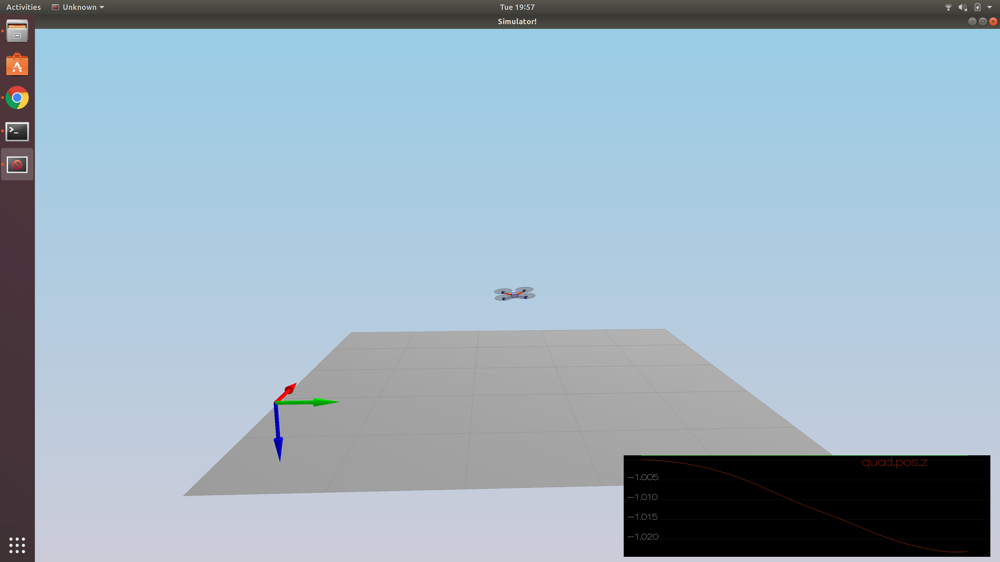
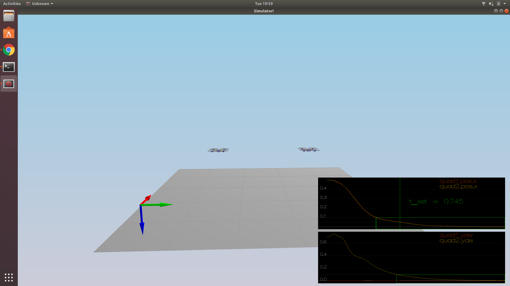
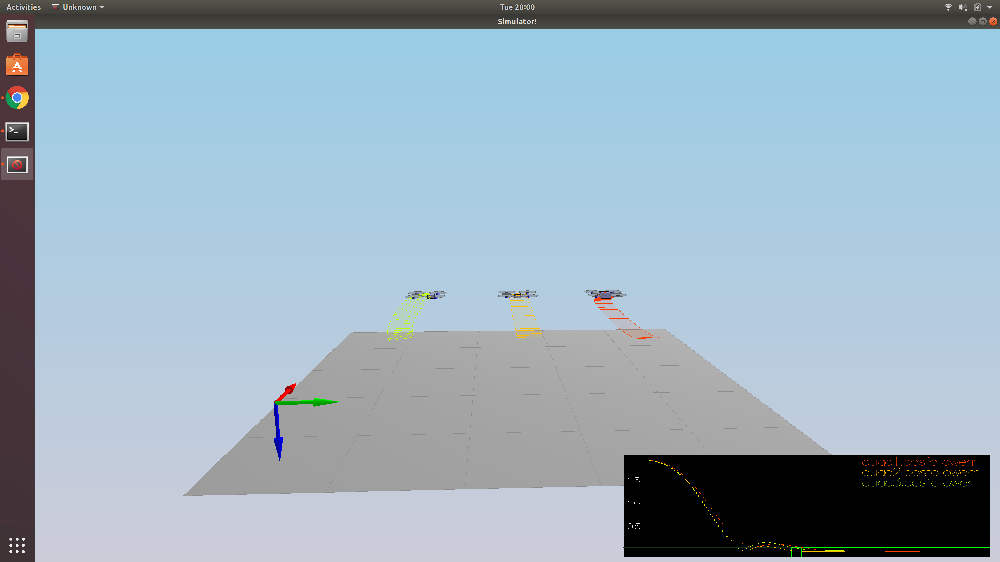
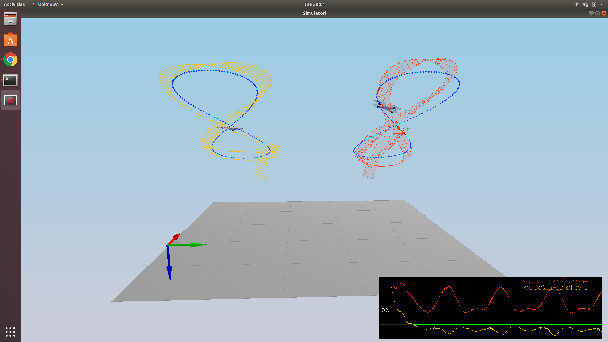

## Project 3 Writeup

### Rubric Points
#### Writeup
This is it.

#### Implemented Controller
The implementation is in the source file `src/QuadControl.cpp`.  The actual implementation follows the Python implementation from the lecture, specifically Exercises 1-5.

##### Implement body rate control in C++
See lines 111-114.

##### Implement roll pitch control in C++
See lines 145-158.

##### Implement altitude controller in C++
See lines 190-201.

##### Implement lateral position control in C++
See lines 239-247.

##### Implement yaw control in C++
See lines 270-271.

##### Implement calculating the motor commands given commanded thrust and moments in C++
See lines 76-79.

### Flight Evaluation

Gains from `config/QuadControlParams.txt` are tuned from the nominal ones provided, with exceptions mentioned in the sections below.  The strategy for tuning gains follows the idea presented in the lectures, which coincides with the order of the controllers presented in the *Implemented Controller* section:

body rate -> roll pitch -> altitude -> lateral position -> yaw

The default gains were way too low, so I looked at increasing them roughly 10-20x.  I left the default values in the config file; I just commented them out.

The passing of each scenario is demonstrated by figures that show green boxes when passing criteria is observed.

#### Scenario 1
Modified the `QuadControlParams.Mass` value from 0.4 to 0.49 after some trial-and-error with changing the parameter and observing whether or not the simulated vehicle stays level.  There is still some vertical movement, but the vehicle's height stays more or less constant over the simulated timeline.  Here's an image showing the vehicle at a random point along its trajectories:

##### Metrics
_None_

#### Scenario 2

##### Metrics
* roll should less than 0.025 radian of nominal for 0.75 seconds (3/4 of the duration of the loop)
* roll rate should less than 2.5 radian/sec for 0.75 seconds

#### Scenario 3

##### Metrics
* X position of both drones should be within 0.1 meters of the target for at least 1.25 seconds
* Quad2 yaw should be within 0.1 of the target for at least 1 second

#### Scenario 4

##### Metrics
* position error for all 3 quads should be less than 0.1 meters for at least 1.5 seconds

#### Scenario 5
The task, as I read it, is to get _one_, not both, of the quads to pass the error test.  The plot below shows that `Quad2` achieves the desired objective.

##### Metrics
* position error of the quad should be less than 0.25 meters for at least 3 seconds

